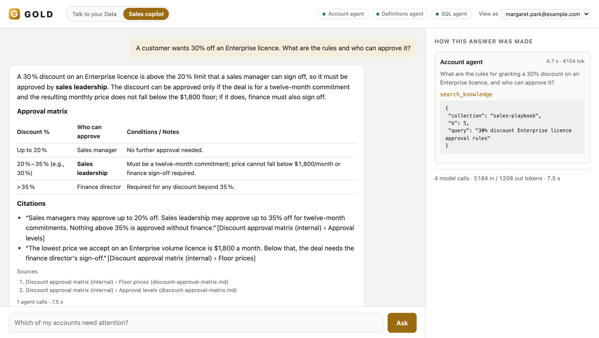
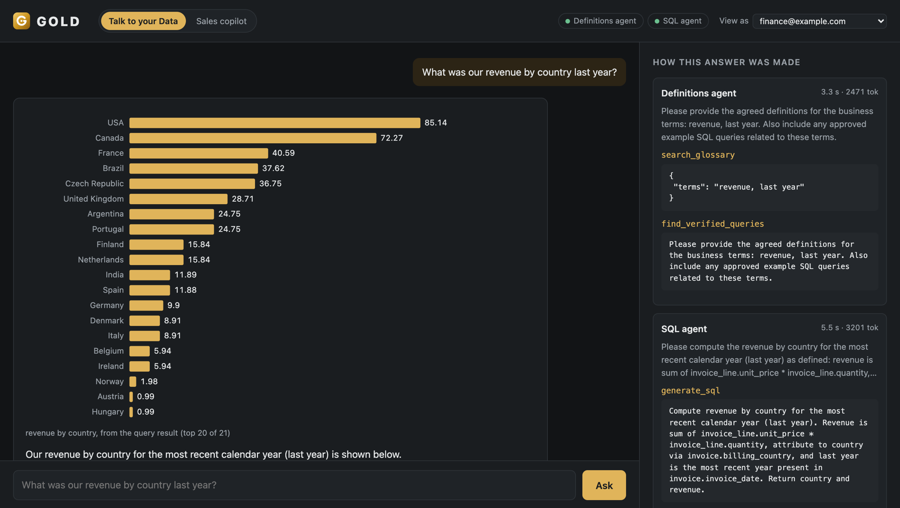
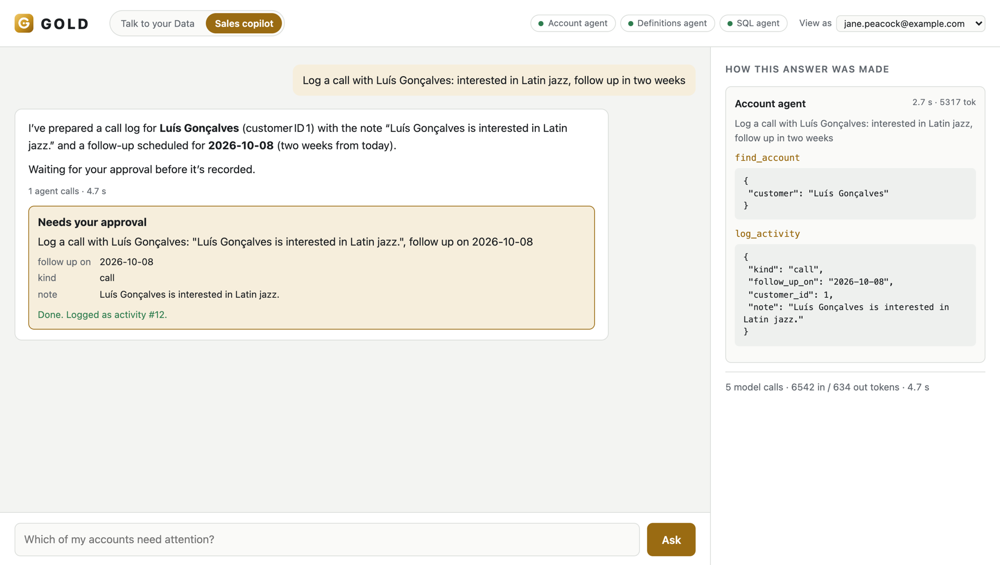
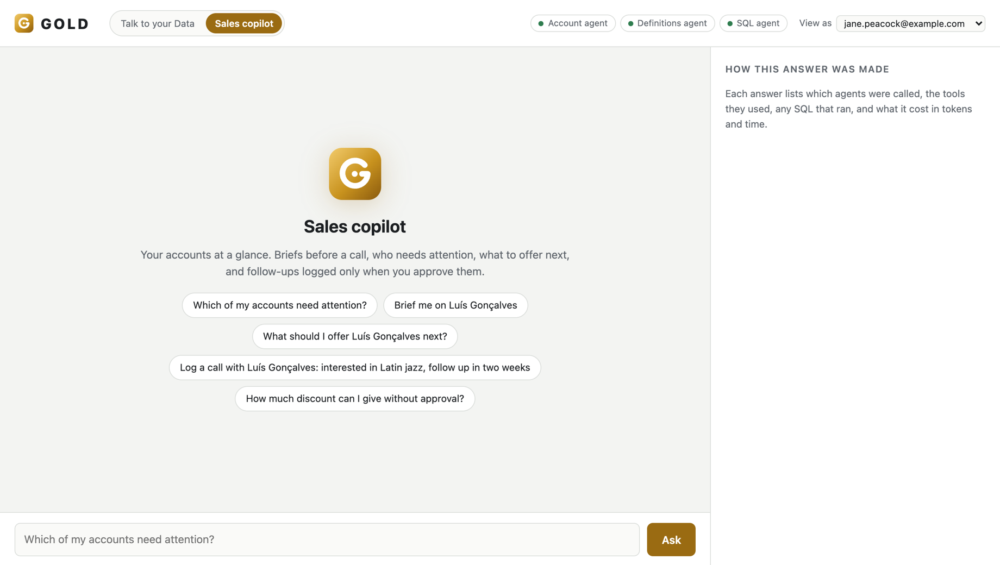
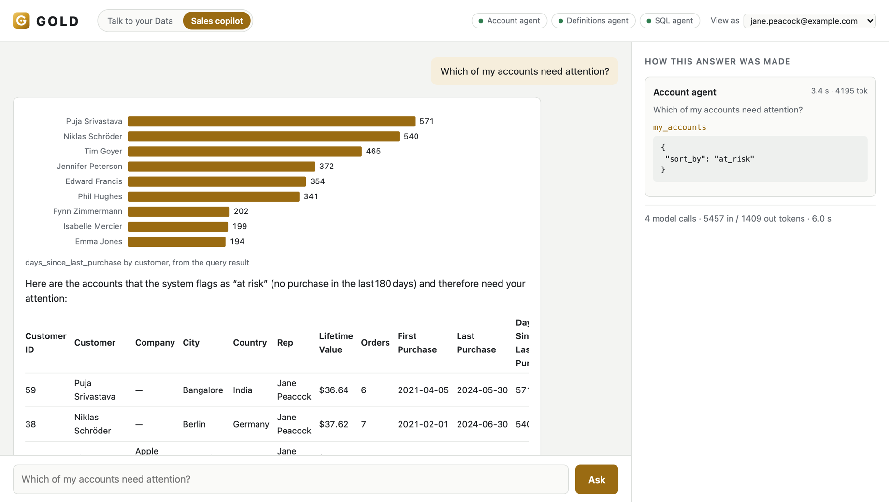

<p align="center">
  <picture>
    <source media="(prefers-color-scheme: dark)" srcset="docs/images/logo-dark.svg">
    
  </picture>
</p>

<h1 align="center">GOLD Agentic AI - Reference Architecture</h1>

<p align="center">
  <b>Build multi-agent apps your enterprise can trust.</b><br>
  Identity to the database, human approvals, cited knowledge, audit and tracing: built once, for every app.
</p>

<p align="center">
  <a href="https://github.com/mundabra/gold-agentic-ai/actions/workflows/ci.yml"></a>
  <a href="https://github.com/mundabra/gold-agentic-ai/releases"></a>
  <a href="LICENSE"></a>
  
  <a href="deploy/helm/gold"></a>
  <a href="compose.yaml"></a>
</p>
<p align="center">
  
  
  
  
  
  
  
</p>

<p align="center">
  <a href="#-quickstart">Quickstart</a> ·
  <a href="#-how-it-works">How it works</a> ·
  <a href="#-sample-apps">Sample apps</a> ·
  <a href="docs/build-an-app.md">Build an app</a> ·
  <a href="#-documentation">Docs</a> ·
  <a href="#-roadmap">Roadmap</a>
</p>

<p align="center">
  
</p>

GOLD is an open-source reference architecture for putting AI agents in front of employees without losing control of data, actions, quality or cost. The **platform** does the hard enterprise parts once. **Apps** sit on top as folders: a manifest, a few agents and their tools. Add an app and the whole platform works for it. It runs on any Kubernetes cluster with any OpenAI-compatible model: a hosted API, your own fine-tuned model, or open models on your own GPUs.

> [!NOTE]
> **For** platform teams building agents for their company. **It is** a working, tested reference you can run in two minutes and adapt, not a hosted product.

## ✨ Why GOLD

<table>
<tr>
<td width="50%" valign="top">

### 🛡️ Governed
The signed-in user's identity travels to every agent, tool and query, and **Postgres row-level security** decides which rows and which documents they see. Agents **propose** actions; only the person who asked can **approve** them, exactly once ([approvals](docs/approvals.md)). Guardrails, restricted database logins, personal data kept out.

</td>
<td width="50%" valign="top">

### 🔭 Observable
Every answer shows the agents, tools, SQL and sources behind it. Every question and every approval leaves a **JSON audit record**. One **OpenTelemetry** trace per question across all services ([observability](docs/observability.md)). `gold eval`, `gold bench` and **NVIDIA AIPerf** measure quality and speed before a change ships.

</td>
</tr>
<tr>
<td width="50%" valign="top">

### 🧱 Layered
Platform, apps, tools, data and models are separate layers joined by open standards: **OpenAI-compatible** model APIs, **A2A** between agents, **MCP** for tools, the **OpenAI Agents SDK** for agent logic. Swap a model, add an agent or ship a new app without touching the layers around it.

</td>
<td width="50%" valign="top">

### 🚀 Deployable
One container image. **Docker Compose** on a laptop; a **Helm chart** for any Kubernetes with per-component secrets and NetworkPolicies; a path from a hosted API to **vLLM or NVIDIA NIM** on your own GPUs, with a Nemotron profile included.

</td>
</tr>
</table>

## 🧩 Sample apps

Two deliberately different apps: one read-only analytics, one that takes actions. Together they exercise every part of the platform, and they are the templates for [your own](docs/build-an-app.md).

<table>
<tr>
<td width="50%" valign="top">

### [Talk to your Data](apps/data_analyst/README.md)
**For analysts, finance and leadership.** Ask in plain language, get the number your company's definitions agree on, with the SQL shown and a chart drawn from the query's own rows.

- Definitions agent + SQL agent
- Governed glossary and approved example queries
- SQLGlot checks, dry-run cost limit, read-only login
- **95%** end to end on the sample questions



</td>
<td width="50%" valign="top">

### [Sales copilot](apps/sales_copilot/README.md)
**For sales reps.** "Who needs attention?", "brief me on this account", "how much discount can I give?", "log a call and follow up in two weeks".

- Account agent with typed CRM tools, no free SQL
- Each rep sees only their own accounts and documents
- Answers from the sales playbook, **with citations**
- Nothing is written until the rep **approves** it



</td>
</tr>
</table>

## 🔧 How it works

<p align="center">
  
</p>

1. A person asks in an app. The **orchestrator** signs them in, applies the app's guardrails and loads the conversation.
2. It gives the app's instructions to an Agents SDK agent, with the agents that app may use, found live in the **registry**, as its tools.
3. **Agents** (A2A services) work through **MCP tools**, including `search_knowledge` over company documents. The user's signed identity goes with every call, so the database filters rows and documents per person.
4. A tool that would change something returns a **proposal**. The person approves or rejects it; only then does the platform run it, once.
5. The answer comes back with its trace and sources, and an audit record is written.

More in the [architecture guide](docs/architecture.md).

## 🚀 Quickstart

> [!TIP]
> No API key needed: a scripted stand-in model answers the example questions, so you can see the whole flow first.

```bash
git clone https://github.com/mundabra/gold-agentic-ai.git && cd gold-agentic-ai
cp .env.example .env
docker compose --profile scripted up --build
```

Open **<http://localhost:8080>**, pick an app at the top, and click an example. To see per-user access, set `GOLD_AUTH_MODE=demo` in `.env` and choose who to **view as**: Jane Peacock (sales) and Margaret Park (sales leadership) see different accounts and documents.

Ready for a real model? Put any OpenAI-compatible endpoint in `.env` and run `docker compose up --build` ([stage 1](docs/stage-1-api.md)).

## 🖼️ Gallery

<table>
<tr>
<td width="50%"><p align="center"><sub><b>Pick an app.</b> Each app brings its own agents, tools and examples.</sub></p></td>
<td width="50%"><p align="center"><sub><b>Per-user data.</b> Jane sees only her nine at-risk accounts, charted from the tool's rows.</sub></p></td>
</tr>
<tr>
<td width="50%"><p align="center"><sub><b>Actions need a person.</b> The agent proposes; the rep approves; it runs once.</sub></p></td>
<td width="50%"><p align="center"><sub><b>Shown work.</b> Definitions, SQL and every tool call beside the answer.</sub></p></td>
</tr>
</table>

## 🛠️ Build your own app

An app is a folder under `apps/` with an `app.yaml`:

```yaml
name: it-helpdesk
title: IT helpdesk
description: Answers IT questions from the handbook and opens tickets you approve.
instructions: instructions.md          # the app's orchestrator prompt
agents: [Ticket agent]                 # registry agents this app may call (yours or other apps')
components:                            # what `gold serve <component>` runs
  ticket-agent: apps.it_helpdesk.agents.ticket_agent
  mcp-tickets: apps.it_helpdesk.tools.ticket_tools
knowledge:                             # documents its agents search, with citations
  it-handbook: {path: knowledge, description: How we run IT}
ui:
  examples: ["My laptop won't connect to the VPN"]
```

Agents are Agents SDK agents served over A2A with one call. Tools are MCP servers, and a tool that changes something wraps its write in `approvals.gate(...)`. Sign-in, guardrails, memory, approvals, knowledge, audit, tracing, feedback, the UI and the deployment come from the platform. **[Build an app →](docs/build-an-app.md)**

## 📦 What's in the box

| Area | Included |
|---|---|
| **Agents** | OpenAI Agents SDK agents served over A2A; a registry with Agent Cards; apps that share agents |
| **Tools** | MCP tool servers; read and write annotations; the signed-in user in every tool |
| **Knowledge (RAG)** | pgvector in Postgres; embeddings through the same OpenAI-compatible endpoint; access by group; citations; retrieval eval ([knowledge](docs/knowledge.md)) |
| **Identity** | Proxy or OIDC sign-in; a signed user context across services; Postgres row-level security ([identity](docs/identity.md)) |
| **Actions** | Signed proposals; approval by the person who asked; run once; audited ([approvals](docs/approvals.md)) |
| **Safety** | Input guardrails; optional NVIDIA NeMo Guardrails; SQLGlot checks; column grants; masking ([guardrails](docs/guardrails.md)) |
| **Observability** | OpenTelemetry traces; JSON audit trail; a trace panel in the UI ([observability](docs/observability.md)) |
| **Quality** | `gold eval` quality gates; `gold bench`; NVIDIA AIPerf serving benchmarks ([evaluation](docs/evaluation.md)) |
| **Learning loop** | "Useful / Not right" feedback, reviewed and promoted to approved examples ([feedback](docs/feedback.md)) |
| **Models** | Any OpenAI-compatible endpoint; LiteLLM gateway with model roles; vLLM and a Nemotron profile ([models](docs/models.md)) |
| **Deployment** | One image; Docker Compose; a Helm chart with NetworkPolicies and per-component secrets ([production](docs/production.md)) |

## 📏 Measured, not assumed

| What was measured | Result |
|---|---|
| Talk to your Data, whole system, 20 business questions | **95%** correct ([runs and caveats](apps/data_analyst/evals/RESULTS.md)) |
| SQL step, without → with agreed definitions | **80–90% → 100%** |
| SQL step p99 latency, reasoning on → off (NVIDIA AIPerf, one stream) | **6–13 s → about 2 s**, same accuracy ([performance](apps/data_analyst/evals/PERFORMANCE.md)) |
| Knowledge retrieval, sales playbook, 14 questions (`qwen3-embedding-8b` on pgvector) | **100%** right document first ([knowledge](docs/knowledge.md#measure-retrieval)) |

The sets are small and the definitions and documents were written alongside the questions. Treat these as a demonstration of the method, and run `gold eval` and `gold knowledge eval` on your own questions.

## 📈 The adoption path

Enterprises rarely start with GPUs. They start with an API, find where it falls short on their data, specialise, and then decide whether to own the inference. The code stays the same at every stage; only configuration changes.

| | Stage | What you do | Done when |
|---|---|---|---|
| **1** | [Start with an API](docs/stage-1-api.md) | Point GOLD at a hosted OpenAI-compatible model | `gold eval` gives a baseline you trust |
| **2** | [Specialise with fine-tuning](docs/stage-2-fine-tune.md) | Build a dataset from approved queries and fine-tune a small open model with LoRA | The fine-tuned model passes the same quality gate |
| **3** | [Own the inference](docs/stage-3-own-inference.md) | Serve models with vLLM or NVIDIA NIM on your GPUs, behind the LiteLLM gateway | `gold eval` and `gold bench` match your targets |

GOLD never names a real model. Agents ask for roles (`gold-general`, `gold-sql`, `gold-embed`), and the gateway decides which model answers each one ([choosing models](docs/models.md)).

## ☸️ Deploy on Kubernetes

```bash
kubectl create secret generic gold-llm --from-literal=apiKey="$API_KEY"
helm install gold deploy/helm/gold \
  --set scriptedModel.enabled=false \
  --set llm.existingSecret=gold-llm \
  --set llm.baseUrl=https://your-provider.example/v1 \
  --set llm.orchestratorModel=... --set llm.agentModel=... --set llm.sqlModel=... --set llm.embeddingModel=...
kubectl port-forward svc/gold-orchestrator 8080:80
```

The chart can also run the LiteLLM gateway (`gateway.enabled`), vLLM on GPU nodes (`vllm.enabled`), NVIDIA NeMo Guardrails (`guardrails.enabled`) and NetworkPolicies (`networkPolicy.enabled`). Serve only some apps with `apps.enabled`. For open models on your GPUs, start from `-f deploy/helm/gold/profiles/nemotron.yaml`. Before production, read the **[production checklist](docs/production.md)**.

## 📚 Documentation

| Get started | Build | Run in production |
|---|---|---|
| [Architecture](docs/architecture.md) | [Build an app](docs/build-an-app.md) | [Production checklist](docs/production.md) |
| [Stage 1: start with an API](docs/stage-1-api.md) | [Approvals](docs/approvals.md) | [Identity and row-level security](docs/identity.md) |
| [Stage 2: fine-tune](docs/stage-2-fine-tune.md) | [Knowledge (RAG)](docs/knowledge.md) | [Guardrails](docs/guardrails.md) |
| [Stage 3: own the inference](docs/stage-3-own-inference.md) | [Extending GOLD](docs/extending.md) | [Observability](docs/observability.md) |
| [Choosing models](docs/models.md) | [Evaluation](docs/evaluation.md) | [Feedback loop](docs/feedback.md) |

## 📍 Roadmap

- ✅ **v0.5.0, knowledge (RAG):** pgvector, one `search_knowledge` tool for every app, access by group, citations, retrieval eval
- ✅ **v0.4.0, the platform:** apps as folders, one orchestrator and UI for every app, human approvals, the Sales copilot
- ✅ **v0.3.0, enterprise controls:** OpenTelemetry and audit, identity with row-level security, verified queries, feedback loop, NeMo Guardrails, Nemotron profile
- 🔜 **v0.6, trust boundaries:** separate signing keys, approvals routed by the platform, a hardened registry, explicit app membership, a fail-closed production profile, an adversarial test suite, supply-chain gates, a threat model
- 🔜 **v0.7, production posture:** workload identity, control-plane state in Postgres for replicas, a production Helm profile, request budgets, policy-driven approvals, audit integrity, metrics and SLOs

What comes first, what waits and what we won't do: **[ROADMAP.md](ROADMAP.md)**.

## 🗂️ Project layout

```text
gold/               the platform: orchestrator (API, UI, guardrails), registry, A2A host, MCP helpers,
                    identity, approvals, knowledge (RAG), audit, tracing, sessions, feedback, app loader, CLI
apps/data_analyst/  Talk to your Data: agents, tools, SQL checks, evaluation, fine-tuning recipe
apps/sales_copilot/ Sales copilot: Account agent, CRM tools, the sales playbook (knowledge)
deploy/             Postgres with pgvector, LiteLLM, NeMo Guardrails, the Helm chart
docs/               guides and reference
tests/              unit tests, and both apps end to end with the scripted model
```

## 🤝 Contributing

Issues and pull requests are welcome: start with [CONTRIBUTING.md](CONTRIBUTING.md). If you use an AI coding agent, point it at [AGENTS.md](AGENTS.md), which has the setup, the checks and the rules in one place. Security issues: see [SECURITY.md](SECURITY.md).

---

<p align="center">
  <sub>Sample data: the <a href="https://github.com/lerocha/chinook-database">Chinook database</a> (MIT). Released under the <a href="LICENSE">Apache 2.0 license</a>.<br>
  Built on open standards: A2A · MCP · OpenAI-compatible APIs · PostgreSQL · Kubernetes</sub>
</p>
