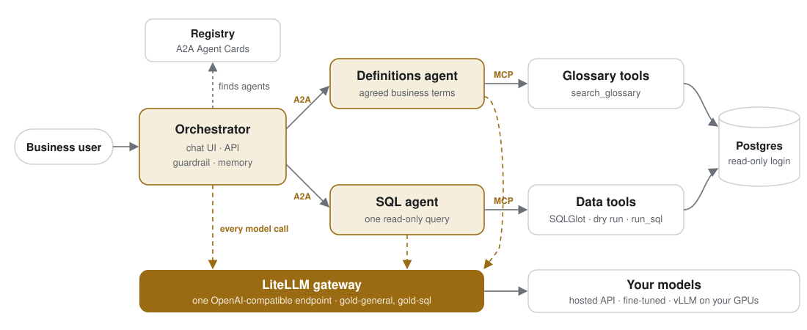
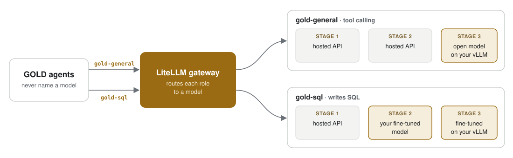

# GOLD

[](https://github.com/mundabra/gold-ai-agent/actions/workflows/ci.yml)
[](LICENSE)

**Governed Open Language-to-Data.** Ask in plain language. Get the governed number.

GOLD is an open-source reference architecture for **"talk to your data" assistants that enterprises can trust**. Business users ask questions in plain English. GOLD answers with the number, the business definition it used and the SQL it ran, so every answer can be checked. It runs on any Kubernetes cluster with any OpenAI-compatible model: a hosted API, your own fine-tuned model, or open models on your own GPUs.

**For** platform and data teams who need to put natural-language analytics in front of business users without losing control of accuracy, access or cost. **It is** a working, tested blueprint you can run in two minutes and adapt; it is not a hosted product.


<sub>A real answer: `gpt-oss-120b` orchestrating, `deepseek-v4-flash` writing SQL, over the sample sales database.</sub>

## Where it fits

| Team | Typical questions |
|---|---|
| Finance | "What was revenue by region last quarter?" · "What is our average order value by country?" |
| Sales operations | "How much revenue did each sales rep bring in?" · "How many active customers do we have?" |
| Product and marketing | "Which product line earned the most last year?" · "How did units sold change month over month?" |
| Leadership | Any of the above, without waiting in the analytics team's queue, and with the definition shown |

The same architecture fits any domain where people ask questions of a SQL database and the answer has to match the company's official numbers.

## Why GOLD

Most "talk to your data" demos get the SQL right and the business wrong. The query runs, but "revenue" meant something different to finance, "last year" was read as the calendar year, and "active customers" counted everyone. No one trusts the number, so no one uses the tool.

GOLD makes the **meaning** of a question part of the system:

1. **Agreed definitions first.** A Definitions agent looks up every business term in a governed glossary, with an owner per term, before any SQL is written.
2. **Governed execution.** A SQL agent writes one read-only query with a dedicated SQL model. The database itself enforces read-only access and hides personal-data columns.
3. **Shown work.** Every answer carries the definition it used, the SQL it ran and a trace of the agents and tools behind it.
4. **Measured, not assumed.** `gold eval` scores any model, or the whole running system, against questions with known-correct answers. Use it as a quality gate before any change ships.

**Measured on 20 business questions** (September 2026, the sample database; [full results and caveats](evals/RESULTS.md)):

| What was tested | Question + schema only | + agreed definitions |
|---|---|---|
| SQL step with `deepseek-v4-flash` | 65–80% | 90–100% |
| SQL step with `gpt-oss-120b` | 90% | 95–100% |
| The whole system end to end (both models together) | — | 90% |

Without definitions, every miss was about business meaning, not SQL syntax: "last year" read as today's date minus one year, or "active customers" counting everyone. The set is small and the glossary was written alongside it, so treat these as a demonstration of the method. Run `gold eval` on your own questions.

## How it works

**Three agents, two tool servers and a registry**, connected by open standards. Every model call goes through one gateway:



| Component | What it does |
|---|---|
| **Orchestrator** | Serves the chat UI and API, blocks requests to change data, calls the specialists, writes the answer. Keeps conversation memory. |
| **Definitions agent** | Resolves business terms ("revenue", "last year", "active customer") from the glossary. |
| **SQL agent** | Writes one query with the dedicated SQL model, runs it read-only, returns the SQL and the result. |
| **Tool servers** (MCP) | `search_glossary`, `describe_schema`, `run_sql`: parsing with SQLGlot, a dry-run cost check, a timeout and a row cap. |
| **Registry** | Specialists register their A2A Agent Card; the orchestrator discovers them on every question. |
| **LiteLLM gateway** | One OpenAI-compatible endpoint for every model call. Routes GOLD's two roles, `gold-general` and `gold-sql`, to whichever models you choose. Optional for a single model. |

| Layer | Standard | Why it matters |
|---|---|---|
| Models | OpenAI Chat Completions | Any hosted API or self-hosted server. Switching models is a configuration change. |
| Agent to agent | [A2A](https://a2a-protocol.org) | Agents deploy, scale and fail independently, and new agents join without code changes. |
| Agent to tools | [MCP](https://modelcontextprotocol.io) | Tools are small servers any MCP client can use. |
| Agent logic | [OpenAI Agents SDK](https://openai.github.io/openai-agents-python/) | Widely used and provider-agnostic. Its trace export to OpenAI is off by default. |

### One endpoint, many models

GOLD never names a real model. It only asks for two roles, `gold-general` (tool calling for the orchestrator and agents) and `gold-sql` (writing SQL). The [LiteLLM](https://docs.litellm.ai) gateway decides which model answers each role, so you can mix providers, run a small fine-tuned model next to a large general one, and move to your own GPUs one role at a time:



<sub>Highlighted boxes are models you own. Each role moves on its own schedule.</sub>

| GOLD asks for | Stage 1: API | Stage 2: fine-tune | Stage 3: own inference |
|---|---|---|---|
| `gold-general` | a hosted tool-calling model | a hosted tool-calling model | an open model on your vLLM |
| `gold-sql` | a hosted SQL model | **your fine-tuned model** | your fine-tuned model on your vLLM |

Each change is a few lines of gateway configuration ([`deploy/litellm/config.yaml`](deploy/litellm/config.yaml) or the Helm `gateway.models` values), with no code changes. For example, stage 2 points the SQL role at your own model:

```yaml
model_list:
  - model_name: gold-sql                      # what GOLD asks for
    litellm_params:
      model: openai/gold-sql                  # served by your vLLM, with your LoRA adapter
      api_base: http://gold-vllm-sql:8000/v1
```

For a first run you can skip the gateway and point GOLD straight at one OpenAI-compatible API ([stage 1](docs/stage-1-api.md)). Add it when you have more than one model to route.

The [architecture page](docs/architecture.md) follows one question step by step and shows where each control sits.

## Try it in two minutes (no API key)

```bash
git clone https://github.com/mundabra/gold-ai-agent.git && cd gold-ai-agent
cp .env.example .env
docker compose --profile scripted up --build
```

Open <http://localhost:8080> and click an example question. This mode uses a **scripted stand-in model**, so only the example questions get real answers. Use it to see the whole flow (agents, tools, database, guardrails) before you connect a model. From a terminal: `docker compose exec orchestrator gold ask "What was our revenue by country last year?" --url http://localhost:8000`.

To use a real model, put any OpenAI-compatible endpoint in `.env` and run `docker compose up --build` ([stage 1](docs/stage-1-api.md)).

## The adoption path

Enterprises rarely start with GPUs. They start with an API, find out where it falls short on their data, specialise, and then decide whether to own the inference. GOLD follows that path. The code stays the same at every stage; only configuration changes.

| | Stage | What you do | Why enterprises do it | Done when |
|---|---|---|---|---|
| 1 | [**Start with an API**](docs/stage-1-api.md) | Point GOLD at a hosted OpenAI-compatible model. | Value in an afternoon, with no infrastructure. | `gold eval` gives a baseline you trust. |
| 2 | [**Specialise with fine-tuning**](docs/stage-2-fine-tune.md) | Build a dataset from approved queries (`gold dataset`) and fine-tune a small open model as `gold-sql`. | Test whether a model you own matches the hosted one on *your* schema, at lower cost per question. | The fine-tuned model passes the same quality gate. |
| 3 | [**Own the inference**](docs/stage-3-own-inference.md) | Serve the models with vLLM on your GPUs, behind a LiteLLM gateway. | Data never leaves your environment, cost is predictable at volume, you control latency. | `gold eval` and `gold bench` match your targets. |

The evaluation runs through every stage ([how it works](docs/evaluation.md)):

```bash
gold eval --model gold-sql --min-accuracy 0.9      # quality gate on the SQL step (fails CI below the bar)
gold eval --system http://localhost:8080           # the whole running system, end to end
gold bench --model gold-sql --concurrency 1,4,8    # latency, throughput, cost per 1,000 SQL generations
```

## Governance built in

| Control | How it is enforced |
|---|---|
| Read-only | Three layers: the orchestrator's guardrail stops "delete…" requests before any model call; the tool server parses every query with SQLGlot and allows one `SELECT` only (no DML, DDL, `INTO`, locks or admin functions); the database login has SELECT rights only and read-only transactions. |
| Personal data | The database login cannot read email, phone, fax, street address, postal code or birth date. Queries that try fail, and the schema the model sees leaves them out. Emails and phone numbers are also scrubbed from any text GOLD returns, including error messages. |
| Runaway queries | A dry run asks the database planner for the cost estimate first and refuses anything above `GOLD_MAX_QUERY_COST`. Every query has a 10-second timeout and a row cap. |
| One meaning per term | Definitions live in a glossary table with an owner per term. Agents quote them word for word. |
| Auditable answers | Each response carries the definitions, the SQL that actually ran, the agents and tools called, tokens and time. |
| Your data stays yours | No component sends data anywhere except the model endpoint you configure. The Agents SDK's trace export is off. In stage 1 the schema, question and results go to your hosted model provider. |

Known limits are listed honestly in [production.md](docs/production.md#known-limits), for example that names are readable by design and the guardrail is a keyword filter backed by the database rules.

## Make it yours

- **Your database:** give GOLD a read-only login with column-level grants, and put your definitions in the glossary. ([guide](docs/extending.md#use-your-own-database))
- **A new agent:** one file. It registers itself, and the orchestrator discovers it with no changes. `docker compose --profile scripted --profile example up` adds a Trends agent to watch it happen. ([guide](docs/extending.md#add-an-agent))
- **A new tool:** add a function to an MCP server. ([guide](docs/extending.md#add-a-tool))
- **A different model:** configuration only, then `gold eval`.

## Deploy on Kubernetes

```bash
kubectl create secret generic gold-llm --from-literal=apiKey="$API_KEY"
helm install gold deploy/helm/gold \
  --set scriptedModel.enabled=false \
  --set llm.existingSecret=gold-llm \
  --set llm.baseUrl=https://your-provider.example/v1 \
  --set llm.orchestratorModel=... --set llm.agentModel=... --set llm.sqlModel=...
kubectl port-forward svc/gold-orchestrator 8080:80
```

The chart can also run the LiteLLM gateway (`gateway.enabled`), vLLM on GPU nodes (`vllm.enabled`) and NetworkPolicies (`networkPolicy.enabled`). Before production, read the [production checklist](docs/production.md).

## Roadmap

- **Approved-examples memory:** retrieve similar question-and-SQL pairs that analysts have approved, so GOLD learns from corrections (Postgres full-text search first, then pgvector).
- **Pluggable safety rails:** optional content-safety guardrails (for example NVIDIA NeMo Guardrails, or a safety model called through an Agents SDK guardrail).
- **More databases:** the data tools are three functions; add engines beyond PostgreSQL.
- **Published fine-tuning results:** stage 2 numbers for a small open model against the stage 1 baseline.

## Project layout

```text
gold/            orchestrator (UI, API, guardrail), agents, MCP tool servers, registry,
                 guards (SQLGlot, masking), eval, bench, dataset builder, CLI
deploy/          Postgres (sample data, glossary, read-only login), LiteLLM config, Helm chart
docs/            architecture, the three stages, evaluation, extending, production
evals/           evaluation questions with verified reference SQL, and published results
finetune/        seed training pairs and a LoRA training recipe
examples/        a third agent that joins without touching the orchestrator
tests/           unit tests and the whole system end to end with the scripted model
```

Contributions are welcome: see [CONTRIBUTING.md](CONTRIBUTING.md). The sample data is the [Chinook database](https://github.com/lerocha/chinook-database) (MIT). GOLD is released under the [Apache 2.0 license](LICENSE).
