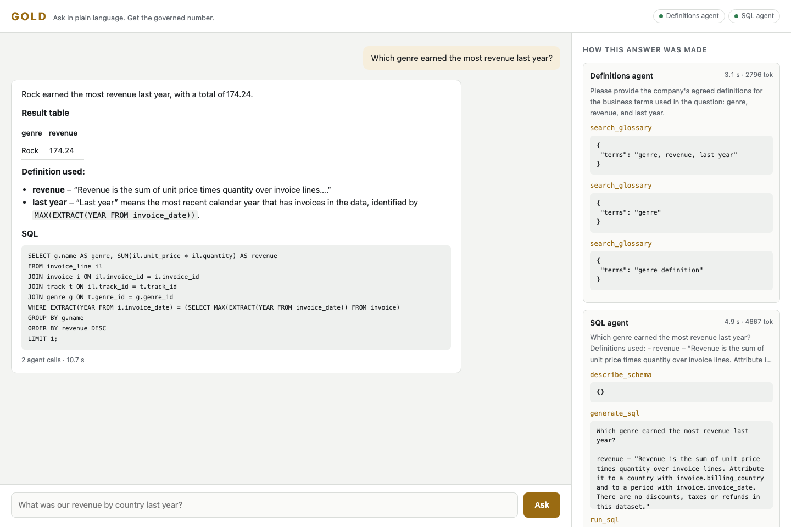

# GOLD

[](https://github.com/mundabra/gold-ai-agent/actions/workflows/ci.yml)
[](LICENSE)

**An enterprise agentic AI reference architecture. Governed · Observable · Layered · Deployable.**

GOLD is an open-source blueprint for putting multi-agent applications in front of employees without losing control of data, actions, quality or cost. The platform does the hard enterprise parts once: identity through to the database, guardrails, human approval for actions, audit, tracing, conversation memory, feedback and evaluation. Apps sit on top as folders: a manifest, a few agents and their tools. Add an app and the whole platform works for it, with no platform changes.

It runs on any Kubernetes cluster with any OpenAI-compatible model: a hosted API, your own fine-tuned model, or open models on your own GPUs.

**For** platform teams building agents for their company. **It is** a working, tested reference you can run in two minutes and adapt; it is not a hosted product.



## Two sample apps

| App | For | What it shows |
|---|---|---|
| [**Talk to your Data**](apps/data_analyst/README.md) | Analysts, finance, leadership | Ask in plain language, get the number your company's definitions agree on, with the SQL shown. A Definitions agent and a SQL agent; read-only; measured at 95% end to end on the sample questions. |
| [**Sales copilot**](apps/sales_copilot/README.md) | Sales reps | "Brief me on this account", "who needs attention?", "what should I offer?", "log a call and follow up in two weeks". Typed tools instead of free SQL, each rep sees only their own accounts, and nothing is written until the rep approves it. It reuses the other app's agents for company-wide numbers. |

They are deliberately different. One is read-only analytics; the other takes actions. Together they exercise every part of the platform, and they are the templates for [building your own app](docs/build-an-app.md).

## What GOLD stands for

| | Pillar | What the platform gives every app |
|---|---|---|
| **G** | **Governed** | The signed-in user's identity travels to the tools and the database, where row-level security decides what they see. Read-only by default. Agents can propose actions; only the person who asked can approve them ([approvals](docs/approvals.md)). Input guardrails, optional NVIDIA NeMo Guardrails, restricted database logins, personal data kept out. |
| **O** | **Observable** | Every answer shows the agents and tools behind it. Every question and every approval leaves a JSON audit record. One OpenTelemetry trace per question across all services ([observability](docs/observability.md)). `gold eval`, `gold bench` and NVIDIA AIPerf measure quality and speed before a change ships. |
| **L** | **Layered** | Platform, apps, tools, data and models are separate layers joined by open standards: OpenAI-compatible model APIs, [A2A](https://a2a-protocol.org) between agents, [MCP](https://modelcontextprotocol.io) for tools, the [OpenAI Agents SDK](https://openai.github.io/openai-agents-python/) for agent logic. Swap a model, add an agent or add an app without touching the layers around it. |
| **D** | **Deployable** | One container image. Docker Compose on a laptop, a Helm chart for any Kubernetes cluster with per-component secrets and NetworkPolicies, and a path from a hosted API to vLLM on your own GPUs (NVIDIA Nemotron profile included). |

## How it works


1. A person asks a question in an app. The **orchestrator** identifies them, applies the app's guardrails and loads the conversation.
2. It gives the app's orchestrator agent the app's instructions and, as tools, only the agents that app may use, found live in the **registry**.
3. **Agents** (A2A services) do the work with **MCP tools**. The user's signed identity goes with every call, so the database filters rows per person.
4. A tool that would change something returns a **proposal** instead of acting. The person approves or rejects it in the app; only then does the platform run it, once.
5. The answer comes back with a trace of every agent and tool call, and an audit record is written.

The [architecture page](docs/architecture.md) covers the components, one request end to end, and where each control sits.

## Try it in two minutes (no API key)

```bash
git clone https://github.com/mundabra/gold-ai-agent.git && cd gold-ai-agent
cp .env.example .env
docker compose --profile scripted up --build
```

Open <http://localhost:8080>, pick an app at the top, and click an example. This mode uses a **scripted stand-in model**, so only the example questions get real answers; use it to see the whole flow before you connect a model. To see per-user access, set `GOLD_AUTH_MODE=demo` in `.env` and choose who to view as.

To use a real model, put any OpenAI-compatible endpoint in `.env` and run `docker compose up --build` ([stage 1](docs/stage-1-api.md)).

## Build your own app

An app is a folder under `apps/` with an `app.yaml`:

```yaml
name: it-helpdesk
title: IT helpdesk
description: Answers IT questions and opens tickets you approve.
instructions: instructions.md          # the app's orchestrator prompt
read_only: false
agents: [Ticket agent]                 # registry agents this app may call (yours or other apps')
components:                            # what `gold serve <component>` runs
  ticket-agent: apps.it_helpdesk.agents.ticket_agent
  mcp-tickets: apps.it_helpdesk.tools.ticket_tools
ui:
  examples: ["My laptop won't connect to the VPN"]
```

Agents are Agents SDK agents served over A2A with one call; tools are MCP servers; a tool that changes something wraps its write in `approvals.gate(...)`. The platform supplies identity, guardrails, memory, approvals, audit, tracing, feedback, the UI and the deployment. [Build an app](docs/build-an-app.md) walks through it with the Sales copilot as the example.

## The adoption path

Enterprises rarely start with GPUs. They start with an API, find where it falls short on their data, specialise, and then decide whether to own the inference. The code stays the same at every stage; only configuration changes.

| | Stage | What you do | Done when |
|---|---|---|---|
| 1 | [**Start with an API**](docs/stage-1-api.md) | Point GOLD at a hosted OpenAI-compatible model. | `gold eval` gives a baseline you trust. |
| 2 | [**Specialise with fine-tuning**](docs/stage-2-fine-tune.md) | Build a dataset from approved queries (`gold dataset`) and fine-tune a small open model with LoRA for the SQL role. | The fine-tuned model passes the same quality gate. |
| 3 | [**Own the inference**](docs/stage-3-own-inference.md) | Serve models with vLLM or NVIDIA NIM on your GPUs, behind the LiteLLM gateway. | `gold eval` and `gold bench` match your targets. |

GOLD never names a real model. Agents ask for roles (`gold-general` for tool calling, `gold-sql` for the SQL step), and the optional [LiteLLM](https://docs.litellm.ai) gateway decides which model answers each one, so each role can move to your own models on its own schedule ([choosing models](docs/models.md)).

## Measured, not assumed

On 20 business questions over the sample database, Talk to your Data scored **95% end to end**, and its SQL step went from 80–90% to **100%** once the agreed definitions were in the prompt ([every run and its caveats](apps/data_analyst/evals/RESULTS.md)). Every miss without definitions was about business meaning, not SQL syntax. In a serving benchmark with NVIDIA AIPerf, turning reasoning off for the SQL step cut single-stream p99 latency from 6–13 s to about 2 s with no loss of accuracy ([performance](apps/data_analyst/evals/PERFORMANCE.md)). The set is small; treat this as a demonstration of the method and run `gold eval` on your own questions.

## Governance built in

| Control | How it is enforced |
|---|---|
| Per-user access | Sign-in through your proxy or identity provider (OIDC). A signed user context travels to every agent and tool; Postgres row-level security decides which rows each person sees ([identity](docs/identity.md)). |
| Actions need a person | Write tools return a signed proposal; the platform runs it only after the person who asked approves, exactly once. Agents never hold the key, so they cannot approve their own actions ([approvals](docs/approvals.md)). |
| Read-only where it should be | A read-only app blocks change requests before any model call; the SQL tools allow one `SELECT` (SQLGlot); the database login has SELECT rights only. The Sales copilot's only write login can add CRM activities and nothing else. |
| Personal data | Database logins cannot read email, phone, address or birth date columns. Emails and phone numbers are also scrubbed from text GOLD returns. |
| Runaway queries | A dry run checks the planner's cost estimate first; every query has a timeout and a row cap. |
| Auditable | Each response carries its trace; every question, proposal, approval and rejection leaves a JSON audit record; OpenTelemetry traces span all services with content kept out by default. |
| Safety rails (optional) | NVIDIA NeMo Guardrails checks questions (and optionally answers) for jailbreaks, off-topic requests and personal data ([guardrails](docs/guardrails.md)). |
| Your data stays yours | Nothing is sent anywhere except the model endpoint you configure; the Agents SDK's trace export is off. |

Known limits are listed in the [production checklist](docs/production.md#known-limits).

## Deploy on Kubernetes

```bash
kubectl create secret generic gold-llm --from-literal=apiKey="$API_KEY"
helm install gold deploy/helm/gold \
  --set scriptedModel.enabled=false \
  --set llm.existingSecret=gold-llm \
  --set llm.baseUrl=https://your-provider.example/v1 \
  --set llm.orchestratorModel=... --set llm.agentModel=... --set llm.sqlModel=...
kubectl port-forward svc/gold-orchestrator 8080:80
```

The chart can also run the LiteLLM gateway (`gateway.enabled`), vLLM on GPU nodes (`vllm.enabled`), NVIDIA NeMo Guardrails (`guardrails.enabled`) and NetworkPolicies (`networkPolicy.enabled`). Serve only some apps with `apps.enabled`. For open models on your GPUs, start from `-f deploy/helm/gold/profiles/nemotron.yaml`. Before production, read the [production checklist](docs/production.md).

## Roadmap

**Done:**
- **v0.4.0, the platform:** apps as folders with a manifest; one orchestrator and UI for every app; human approval for actions; the Sales copilot as a second sample app.
- **v0.3.0, enterprise controls:** OpenTelemetry and audit, identity with row-level security, verified queries, the feedback loop, NVIDIA NeMo Guardrails, the Nemotron profile, charts.

**Next, in rough order:**
- **Knowledge retrieval (RAG):** a small retriever interface in the platform, exposed to agents as an MCP `search_knowledge` tool, with pgvector as the default store and other vector databases as one-file adapters. The Sales copilot's playbook is the first corpus.
- **A semantic model:** metrics, dimensions and joins defined once, alongside the glossary.
- **Cost per user and per app:** pass the signed-in user and the app to the gateway so spend is attributed.
- **More databases** beyond PostgreSQL, and **chat front-ends** (Slack, Microsoft Teams) on the same API and identity.

## Project layout

```text
gold/               the platform: orchestrator (API, UI, guardrails), registry, A2A host, MCP helpers,
                    identity, approvals, audit, tracing, sessions, feedback, app loader, CLI
apps/data_analyst/  Talk to your Data: agents, tools, SQL checks, evaluation, fine-tuning recipe
apps/sales_copilot/ Sales copilot: Account agent, CRM tools
deploy/             Postgres (sample data, glossary, logins, row-level security), LiteLLM, guardrails, Helm chart
docs/               architecture, building an app, approvals, the three stages, production
tests/              unit tests, and both apps end to end with the scripted model
```

Contributions are welcome: see [CONTRIBUTING.md](CONTRIBUTING.md), and [AGENTS.md](AGENTS.md) for AI coding agents. The sample data is the [Chinook database](https://github.com/lerocha/chinook-database) (MIT). GOLD is released under the [Apache 2.0 license](LICENSE).
