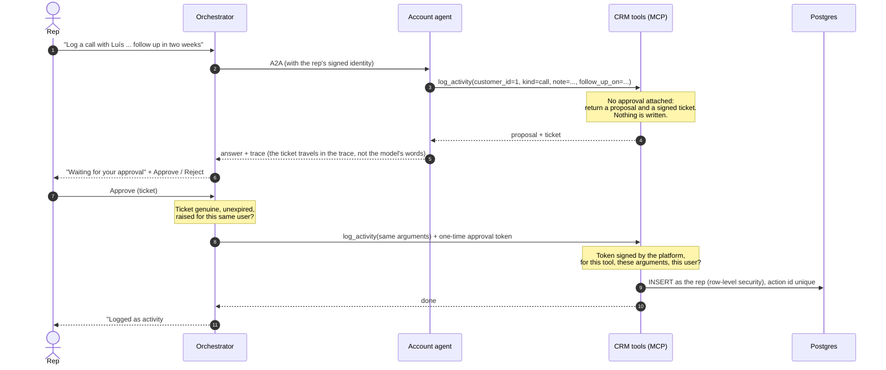

# Approvals: agents propose, people decide

Agents in GOLD can take actions, such as logging a call in the CRM, but only after the person who asked approves the exact action. This is enforced by the platform and the tool, not by asking the model to be careful.

## What the user sees

1. They ask: *"Log a call with Luís Gonçalves: interested in Latin jazz, follow up in two weeks."*
2. The answer says the entry is ready and **waiting for approval**, with a card showing exactly what will be written: kind, note, follow-up date.
3. **Approve** writes it and shows the result ("Logged as activity #13"). **Reject** writes nothing.

Nothing is written before step 3.

## How it works



- **The ticket** is what the tool returns instead of acting: the tool, the exact arguments, a one-line summary, the server that raised it, the user, an action id and an expiry (`GOLD_APPROVAL_TTL_SECONDS`, one hour by default). It is signed.
- **The approval token** is created by the orchestrator only when the person approves. It wraps the ticket, names the approver and expires after two minutes. The tool accepts it only for the same tool, the same arguments and the same user.
- Both are HMAC-signed with `GOLD_IDENTITY_SECRET`, the key every GOLD service shares for the signed user context. Models never see it. A ticket and an approval are signed as different kinds, so one can't be passed off as the other.
- **The action id** from the ticket is the tool's idempotency key (a unique column in `crm_activity`), so approving twice, or replaying a token, writes once.
- **The database has the last word.** The write login can insert CRM activities only, and row-level security refuses rows for accounts the rep can't see, whatever the application does.

## Why not pause the agent?

The OpenAI Agents SDK can pause a run for approval inside one process. In GOLD the tool runs in a different service from the orchestrator, behind an agent that is itself a separate A2A service, and any replica may handle the approval minutes later. Signed, stateless tickets work across services and replicas with no shared state, survive restarts, and keep the rule in the tool, where the action happens. The trade-off: after approval the platform runs the tool directly, so the agent doesn't see the result in the same turn. The next question does, through the data.

## Audit

Each proposal is listed in the question's audit record (`actions_proposed`). Each decision is its own record:

```json
{"event": "action", "decision": "approved", "user": "jane.peacock@example.com", "action_id": "5f0c…",
 "tool": "log_activity", "summary": "Log a call with Luís Gonçalves: …", "args": {…}, "result": {…}}
```

`decision` is `approved`, `rejected` or `failed`.

## Add approvals to your own tool

Call `approvals.gate()` before any side effect, and use `gate.action_id` as an idempotency key. See [build an app](build-an-app.md#tools-that-change-things).

## Limits

- The approver must be the person who asked. Approval by someone else (a manager, a second pair of eyes) is a natural next step: check the approver's group in `approvals.check_ticket`.
- With `GOLD_AUTH_MODE=none` there is no user, so anyone who can reach the UI can approve. Use sign-in in any shared environment.
- A ticket can be approved until it expires. Rejecting doesn't revoke it; it records the decision. Keep the TTL short if that matters.
