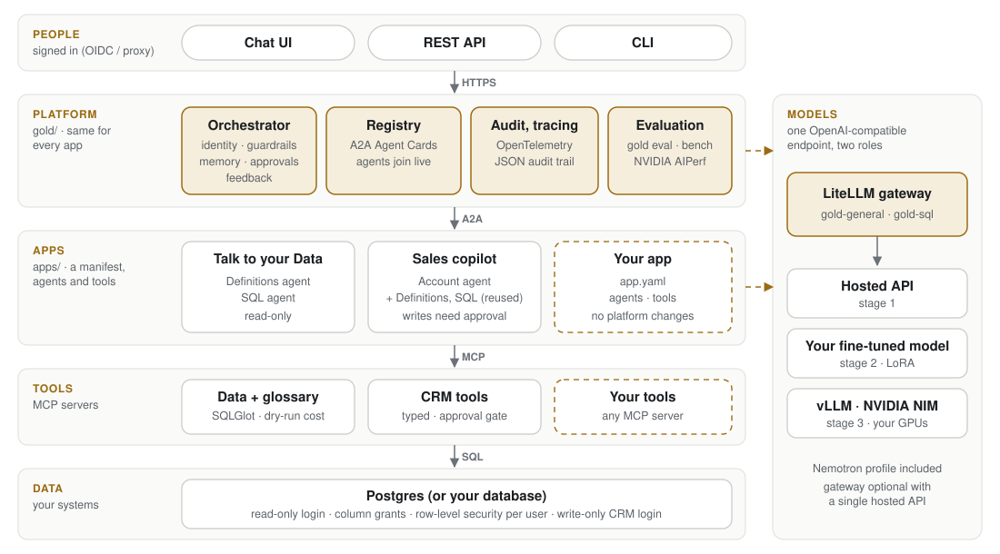

# Architecture

GOLD has two parts: a **platform** that is the same for every app, and **apps** that sit on it. Services talk over open protocols, and every service is the same container image running a different command, so it runs identically under Docker Compose and on any Kubernetes cluster.



## The platform (`gold/`)

| Component | What it does |
|---|---|
| **Orchestrator** | The API and chat UI for every app. For each request it identifies the user, loads the app's manifest, applies its guardrails, keeps conversation memory (Agents SDK sessions, per user and app), and runs an Agents SDK agent with the app's instructions. The agents the app may use are its tools. It returns proposed actions for approval, runs them once approved, and takes feedback. |
| **Registry** | Holds the Agent Card of every live agent. Agents register on start-up and every 30 seconds; stale entries expire. No database. |
| **A2A host** (`a2a_host.py`) | Serves any Agents SDK agent over A2A with one call, and keeps it registered. |
| **MCP helpers** (`mcp.py`) | Serve a tool server, read the signed-in user in a tool, and annotate tools as reading or writing. |
| **Identity** (`identity.py`) | Sign-in modes (proxy headers, OIDC, demo), and the short-lived signed user context that travels to agents and tools ([identity](identity.md)). |
| **Approvals** (`approvals.py`) | Signed proposals and one-time approvals for tools that change things ([approvals](approvals.md)). |
| **Guardrails** | The Agents SDK input guardrail for read-only apps, and optional NVIDIA NeMo Guardrails for every app ([guardrails](guardrails.md)). |
| **Audit and tracing** | A JSON audit record per question and per decision; OpenTelemetry across every service ([observability](observability.md)). |
| **Feedback** | "Useful" / "Not right" into a review queue, with app hooks for what happens next ([feedback](feedback.md)). |
| **App loader** (`apps.py`) | Finds apps (`apps/*/app.yaml`, and `GOLD_APP_PACKAGES`), their components, CLI commands and hooks. |

## The apps (`apps/`)

| App | Agents (A2A) | Tools (MCP) | Data access |
|---|---|---|---|
| **Talk to your Data** (`data-analyst`) | Definitions agent, SQL agent | Glossary tools (`search_glossary`, `find_verified_queries`); data tools (`describe_schema`, `run_sql`) | Read-only login with column grants; row-level security per user |
| **Sales copilot** (`sales-copilot`) | Account agent, plus the two above | CRM tools (`my_accounts`, `find_account`, `account_brief`, `next_best_offers`, `list_activities`, `log_activity`) | The read-only login with row-level security; a separate write-only login for CRM activities, used only after approval |

An app is a manifest plus its agents and tools. Apps can share agents: the Sales copilot's manifest lists the Definitions and SQL agents, which run once and serve both apps. [Build an app](build-an-app.md) walks through one.

Two model roles, set by configuration:

| Alias | Used by | Needs |
|---|---|---|
| `gold-general` | Orchestrator and every agent | Reliable tool calling |
| `gold-sql` | The SQL agent's `generate_sql` step only | Good SQL for your schema. This is the model you fine-tune in stage 2. |

## One question, end to end

A Talk to your Data question:

```mermaid
sequenceDiagram
    autonumber
    actor U as Business user
    participant O as Orchestrator
    participant R as Registry
    participant D as Definitions agent
    participant S as SQL agent
    participant T as MCP tools
    participant DB as Postgres

    U->>O: "What was our revenue by country last year?" (app: data-analyst)
    Note over O: Identify the user; the app is read-only,<br/>so change requests stop here, before any model call
    O->>R: Which agents are live?
    R-->>O: Agent Cards (only the app's agents become tools)
    O->>D: A2A: define the terms in the question (+ signed user)
    D->>T: search_glossary("revenue", "last year")
    T->>DB: glossary lookup
    D-->>O: agreed definitions, with owners
    O->>S: A2A: question + definitions (+ signed user)
    S->>T: describe_schema
    Note over S: generate_sql calls the<br/>dedicated SQL model (gold-sql)
    S->>T: run_sql(SELECT …)
    Note over T: SQLGlot check, dry-run cost,<br/>timeout, row cap
    T->>DB: query as the user (row-level security)
    S-->>O: SQL + result table
    O-->>U: answer + table + definition used + SQL + trace
```

A Sales copilot request follows the same path through the Account agent and the CRM tools. When a tool would change something it returns a proposal instead, and the platform runs it only after the user approves; [approvals](approvals.md) has that sequence.

Every response carries a trace (agents called, tools used and their inputs, tokens, time), which the chat UI shows beside the answer.

## Where each control sits

| Step | Control |
|---|---|
| Request arrives | Sign-in (proxy or OIDC). For read-only apps, a guardrail refuses change requests with no model call. Optional NeMo Guardrails input rails check for jailbreaks, off-topic requests and personal data. |
| Choosing agents | Each app's orchestrator sees only the agents its manifest allows. |
| Calling agents and tools | A short-lived, signed user context travels with every A2A and MCP call; tools verify it. |
| Before SQL is written (data app) | Business terms come from the glossary, and approved example queries show the conventions. |
| Before a query runs (data app) | SQLGlot: exactly one read-only query, no DML, DDL, `INTO`, locks, transaction control or admin functions. The planner's cost estimate is checked. |
| While it runs | Read-only transaction, timeout, and a database login with rights on permitted columns only. Row-level security filters rows per user. |
| Before anything changes | A write tool returns a proposal; only the person who asked can approve it; the tool checks the approval matches exactly; the action id makes it run once; the write login can do that one thing only. |
| Before results leave | Emails and phone numbers scrubbed from text and errors; rows capped. Optional NeMo output rails. |
| After | The answer shows its work; an audit record is written for the question and for each decision. |

## Why these protocols

| Choice | Alternative it avoids | Benefit |
|---|---|---|
| OpenAI Chat Completions for every model call | A provider-specific SDK | Any hosted API, gateway or self-hosted server; switching is a URL change |
| A2A between agents | In-process handoffs | Agents deploy, scale and fail independently, can be written in any language, and can be shared between apps |
| Registry with Agent Cards | Hard-coded agent URLs | New agents appear without redeploying the orchestrator |
| MCP for tools | Tools compiled into each agent | One tool server serves any MCP client, including tools outside GOLD |
| Apps as manifests | One orchestrator per use case | Identity, guardrails, approvals, audit, tracing and deployment are built once |

## Deployment shapes

| | Docker Compose | Helm (any Kubernetes) |
|---|---|---|
| GOLD services | 8 containers from one image (platform: orchestrator, registry; data app: 2 agents, 2 tool servers; sales app: 1 agent, 1 tool server), ports on 127.0.0.1 | One Deployment per component from one image; each gets only the secrets it uses; optional NetworkPolicies |
| Apps | All apps, or `GOLD_APPS` | All apps, or `apps.enabled` |
| Database | Postgres container with sample data | Postgres StatefulSet, or your own database via `database.url` |
| Models | Any API, the scripted model (`--profile scripted`) or the gateway (`--profile gateway`) | Any API, the scripted model, or the gateway plus vLLM on GPU nodes |
| Scaling | One of each | Agents and tool servers scale horizontally; keep one registry and add a shared session store before scaling the orchestrator |
