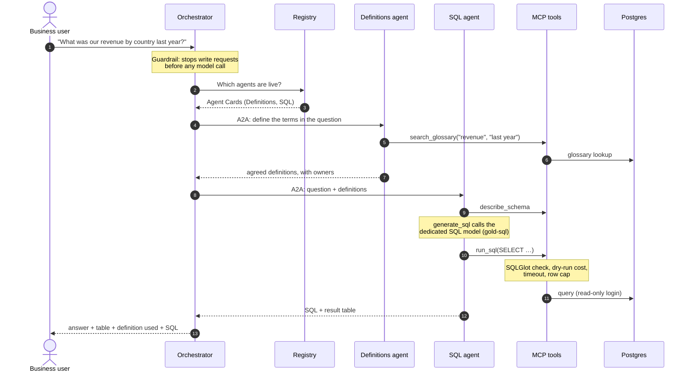

# Architecture

GOLD is **three agents, two tool servers and a registry**, connected by open protocols. Everything is the same container image running a different command, so it runs identically under Docker Compose and on any Kubernetes cluster.

## Components at a glance

| Component | Kind | What it does | Talks to |
|---|---|---|---|
| **Orchestrator** | Agent + web app | Receives the question, blocks write requests, decides which specialists to call, and writes the final answer. Serves the chat UI and the `/api/ask` endpoint. Keeps conversation memory (Agents SDK sessions). | Registry (discovery), specialists (A2A), model endpoint |
| **Definitions agent** | Agent (A2A service) | Finds the agreed meaning of every business term in the question: revenue, active customer, last year. | Glossary tools (MCP), model endpoint |
| **SQL agent** | Agent (A2A service) | Turns the question plus definitions into one read-only query using the dedicated SQL model, runs it, and returns the SQL and the result. | Data tools (MCP), SQL model |
| **Data tools** | MCP server | `describe_schema` and `run_sql`: SQLGlot parsing, dry-run cost limit, timeout, row cap, text scrubbing. | Postgres (read-only login with column grants) |
| **Glossary tools** | MCP server | `search_glossary`: exact phrase match on terms and synonyms, full-text search as fallback. | Postgres |
| **Registry** | Service | Holds the Agent Card of every live specialist. Agents re-register every 30 seconds; stale entries expire. | — |
| **Postgres** | Database | Business data (sample: a digital media store) and the `glossary` table. | — |
| **Model endpoint** | External | Any OpenAI-compatible Chat Completions API. Optionally the LiteLLM gateway, with vLLM on your GPUs behind it. | — |

Two model roles, set by configuration:

| Alias | Used by | Needs |
|---|---|---|
| `gold-general` | Orchestrator, Definitions agent, SQL agent's reasoning loop | Reliable tool calling |
| `gold-sql` | The SQL agent's `generate_sql` step only | Good SQL for your schema. This is the model you fine-tune in stage 2. |

## One question, end to end

Every response also carries a trace (agents called, tools used, SQL run, tokens, time), which the chat UI shows beside the answer.

## Where each control sits

| Step | Control |
|---|---|
| Question arrives | Guardrail refuses requests to change data. No model is called and no tokens are spent. |
| Before SQL is written | Business terms are resolved from the glossary, not guessed by the model. |
| Before a query runs | SQLGlot parses it: exactly one read-only query, with no DML, DDL, `INTO`, locks, transaction control or admin functions anywhere in the tree. The planner's cost estimate is checked. |
| While it runs | Single-statement execution, read-only transaction, 10-second timeout, and a database login with SELECT rights on permitted columns only. Personal-data columns can't be read at all. |
| Before results leave | Emails and phone numbers scrubbed from text and error messages; rows capped. |
| After the answer | The answer shows the definition and SQL used, so a person can check it. |

## Why these protocols

| Choice | Alternative it avoids | Benefit |
|---|---|---|
| OpenAI Chat Completions for every model call | A provider-specific SDK | Any hosted API, gateway or self-hosted server; switching is a URL change |
| A2A between agents | In-process handoffs | Specialists deploy, scale and fail independently, and can be written in any language or framework |
| Registry with Agent Cards | Hard-coded agent URLs | New agents appear without redeploying the orchestrator |
| MCP for tools | Tools compiled into each agent | One tool server serves any MCP client, including tools outside GOLD |
| A dedicated SQL model alias | One model for everything | The SQL step can be fine-tuned and served separately, which is where cost and accuracy gains come from |

## Deployment shapes

| | Docker Compose | Helm (any Kubernetes) |
|---|---|---|
| GOLD services | 6 containers from one image, ports published on 127.0.0.1 | 6 Deployments from one image; each gets only the secrets it uses; optional NetworkPolicies |
| Database | Postgres container with sample data | Postgres StatefulSet, or your own database via `database.url` |
| Models | Any API, the scripted model (`--profile scripted`) or the gateway (`--profile gateway`) | Any API, the scripted model, or the gateway plus vLLM on GPU nodes |
| Scaling | One of each | Agents and tool servers scale horizontally; keep one registry and add a shared session store before scaling the orchestrator |
