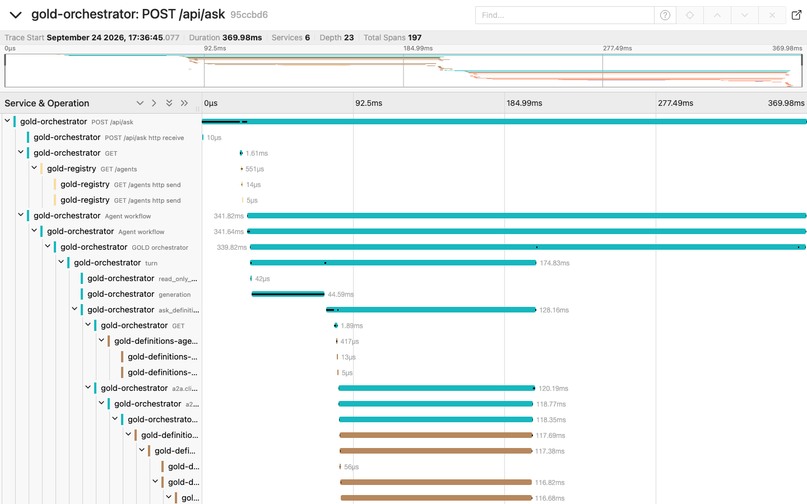

# Observability

GOLD gives you three views of what happened:

| View | Where | Use it for |
|---|---|---|
| **The answer's trace panel** | Chat UI and the `/api/ask` response (`calls`) | "How was *this* answer made?" (agents, tools, SQL, tokens, time) |
| **Audit trail** | One JSON line per question, and per approval decision, on stdout (`gold.audit` logger), optionally a file (`GOLD_AUDIT_LOG`) | Who asked what in which app, which tools and SQL ran, how many rows came back, whether it was blocked, which actions were proposed, approved or rejected |
| **Distributed traces** | Any OpenTelemetry backend | Where time goes across services, and what failed where |

## Distributed tracing

Set one standard variable and every GOLD service exports OpenTelemetry traces:

```bash
OTEL_EXPORTER_OTLP_ENDPOINT=http://your-collector:4318     # OTLP over HTTP
```

A question becomes **one trace** across the orchestrator, the registry, both agents, both tool servers, the database queries and the model calls. The W3C `traceparent` header travels on every A2A, MCP and model call. It works with Jaeger, Grafana Tempo, an OpenTelemetry Collector, or any APM that accepts OTLP.



<sub>One question in Jaeger, run with the scripted test model: 6 services, 197 spans.</sub>

Try it locally:

```bash
echo "OTEL_EXPORTER_OTLP_ENDPOINT=http://jaeger:4318" >> .env
docker compose --profile scripted --profile tracing up --build
# ask a question at http://localhost:8080, then open http://localhost:16686
```

On Kubernetes, set `tracing.otlpEndpoint` in the Helm values.

**What's in the spans:**
- HTTP calls between services;
- agent runs, turns and tool calls (from the OpenAI Agents SDK, via OpenInference);
- MCP tool calls;
- A2A messages;
- database statements (`EXPLAIN`, `SELECT`);
- model requests with their token counts.

**What's kept out:** prompts, generated SQL and query results are redacted by default, because tracing backends are often readable by more people than the data. Set `GOLD_TRACE_CONTENT=true` if your backend is cleared for that data. The Agents SDK's own export to OpenAI stays off either way.

## Audit trail

Every question, answered or blocked, writes one record:

```json
{"event": "question", "time": "2026-09-24T22:41:07.512+00:00", "trace_id": "95ccbd69fa45ca39418630dcd513cbe2",
 "app": "data-analyst", "session_id": "4f1c…", "user": "finance@example.com",
 "question": "What was our revenue by country last year?", "blocked": false, "error": null,
 "agents": ["Definitions agent", "SQL agent"],
 "tools": ["Definitions agent: search_glossary", "Definitions agent: find_verified_queries",
           "SQL agent: generate_sql", "SQL agent: run_sql"],
 "queries": [{"sql": "SELECT i.billing_country …", "rows": 21, "refused": null}],
 "actions_proposed": [], "tokens": 7672, "model_requests": 10, "elapsed_ms": 11350}
```

Approving or rejecting a proposed action writes an `"event": "action"` record with the decision, the user, the tool, its arguments and the result ([approvals](approvals.md#audit)).

- It goes to stdout as a single JSON line, so any log pipeline can collect it. `GOLD_AUDIT_LOG` also appends it to a file.
- `trace_id` links the record to its full trace.
- `user` fills in once identity is configured ([identity](identity.md)).
- The record contains the question and the SQL on purpose. Store it where your audit policy says those belong.
