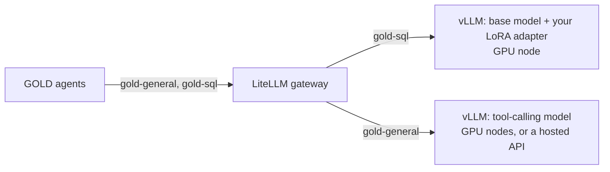

# Stage 3: Own the inference

**Goal:** serve GOLD's models on GPUs you control, behind the same OpenAI-compatible endpoint, with nothing in GOLD changing.

## Why own it

- **Data residency:** questions, schemas and results never leave your environment.
- **Predictable cost at volume:** a GPU costs the same per hour however many questions it answers, while per-token prices grow with usage.
- **Control:** you choose the model version, when it changes, and how latency and throughput are traded off.

It is not free: someone has to run GPUs. Use `gold bench` to compare the cost per 1,000 SQL generations against stage 1 at your expected volume before you commit.

## The shape



GOLD only ever asks for two aliases, `gold-general` and `gold-sql`. The gateway maps them to real endpoints. That lets you move one role at a time: self-host the SQL model first, and keep a hosted API for the general model until you are ready.

## 1. Serve the SQL model with vLLM

The Helm chart runs vLLM model servers on GPU nodes. First put the stage 2 adapter on a volume the server can mount:

```bash
kubectl apply -f - <<'YAML'
apiVersion: v1
kind: PersistentVolumeClaim
metadata: { name: gold-sql-adapters }
spec: { accessModes: [ReadWriteOnce], resources: { requests: { storage: 2Gi } } }
YAML
kubectl run adapter-copy --image=busybox --restart=Never --overrides='{"spec":{"containers":[{"name":"c","image":"busybox","command":["sleep","3600"],"volumeMounts":[{"name":"a","mountPath":"/adapters"}]}],"volumes":[{"name":"a","persistentVolumeClaim":{"claimName":"gold-sql-adapters"}}]}}'
kubectl cp adapters/gold-sql adapter-copy:/adapters/gold-sql && kubectl delete pod adapter-copy
```

Then:

```yaml
# values-stage3.yaml
vllm:
  enabled: true
  servers:
    - name: sql
      model: Qwen/Qwen2.5-Coder-7B-Instruct
      servedModelName: gold-sql-base
      loraModules: "gold-sql=/adapters/gold-sql"   # served under the name GOLD asks for
      adapterClaim: gold-sql-adapters
      gpus: 1
      extraArgs: ["--max-model-len", "8192"]

gateway:
  enabled: true
  models:
    - alias: gold-sql
      model: openai/gold-sql
      apiBase: "http://{{ .Release.Name }}-vllm-sql:8000/v1"   # follows your release name
      apiKeyEnv: ""
    - alias: gold-general
      model: openai/your-tool-calling-model
      apiBase: https://your-provider.example/v1   # still hosted, for now
      apiKeyEnv: GENERAL_API_KEY
  providerKeys:
    GENERAL_API_KEY: "..."

scriptedModel:
  enabled: false
```

```bash
helm upgrade --install gold deploy/helm/gold -f values-stage3.yaml
```

Adapters above LoRA rank 16 need `"--max-lora-rank", "32"` (or higher) in `extraArgs`.

## 2. Serve the general model too (optional)

For full residency, run the tool-calling model on your GPUs as well. vLLM needs tool calling switched on, with the parser that matches the model family:

```yaml
    - name: general
      model: Qwen/Qwen2.5-32B-Instruct
      servedModelName: gold-general
      gpus: 2
      extraArgs: ["--enable-auto-tool-choice", "--tool-call-parser", "hermes", "--tensor-parallel-size", "2"]
```

Then point the `gold-general` alias at `http://{{ .Release.Name }}-vllm-general:8000/v1`. Test tool calling before anything else: if the parser does not match the model, the agents will get text instead of tool calls.

## 3. Prove it before switching

Reach the cluster from your machine, then run the same checks as every other stage:

```bash
kubectl port-forward svc/gold-gateway 4000:4000 &
kubectl port-forward svc/gold-postgres 5432:5432 &
kubectl port-forward svc/gold-orchestrator 8080:80 &
export GOLD_LLM_BASE_URL=http://localhost:4000/v1 GOLD_LLM_API_KEY=<llm.apiKey>

gold eval --model gold-sql --min-accuracy 0.95          # quality did not drop
gold eval --system http://localhost:8080                 # the whole system, end to end
gold bench --model gold-sql --concurrency 1,8,32         # latency and throughput on your GPUs
```

## 4. Benchmark serving with AIPerf

`gold bench` answers "is it fast enough for GOLD's traffic?". To size GPUs and set latency targets, run [NVIDIA AIPerf](https://github.com/ai-dynamo/aiperf) with GOLD's real requests:

```bash
pipx install aiperf
export GOLD_LLM_BASE_URL=http://localhost:4000/v1 GOLD_LLM_API_KEY=<llm.apiKey> GOLD_SQL_MODEL=gold-sql
CONCURRENCY=1,8,32 REQUESTS=200 SLO_MS=2000 scripts/aiperf.sh
```

The script writes the production SQL requests as AIPerf payloads (`gold aiperf-payloads`), sweeps the concurrency levels, and prints one row per level (`gold aiperf-summary`):

| Metric | What it tells you |
|---|---|
| Under target (goodput: share of requests within `SLO_MS`) | The number to agree with the business. |
| First token (time to first token, TTFT) | How long before anything streams back: queueing plus prompt processing. Prefix caching helps, because GOLD's system prompt and schema repeat on every call. |
| First SQL token | For reasoning models, when the answer itself starts, after the thinking. |
| Per token (inter-token latency, ITL) | Time between streamed tokens. Rises as concurrency rises and GPUs are shared. |
| Output tok/s | Total throughput: what one GPU setup can serve. |
| Reasoning share | Tokens spent thinking rather than answering. A fine-tuned model that does not reason brings this near zero. |

A measured baseline on a hosted API is in [evals/PERFORMANCE.md](../evals/PERFORMANCE.md).

## Tuning notes

| Lever | Effect |
|---|---|
| Merge the LoRA adapter into the base weights | Faster serving; you lose the ability to swap adapters per request. Keep adapters unmerged if you serve several schemas or teams from one base model. |
| FP8 or AWQ quantisation | Fits larger models on fewer GPUs; re-run `gold eval` because accuracy can move. |
| `--max-model-len` | Size it to your real prompt (schema + definitions + question) plus the answer. Oversizing wastes KV-cache memory. |
| Prefix caching | GOLD's system prompt and schema repeat on every call, so prefix caching (on by default in recent vLLM) cuts time to first token. |
